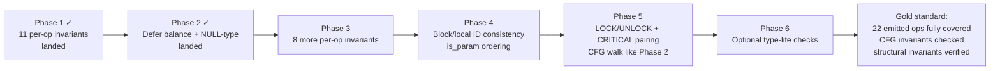

# ir_validate Gold-Standard Plan — Comprehensive Gap Audit

**Status (2026-04-20):** Phase 1 + Phase 2 landed (commits `130ddbd` and
`014f8c8`). Phase 3-5 planned, Phase 6 optional. Outcome tracked in
`BUGS-FIXED.md` and `docs/compiler-internals.md` "ir_validate hardening"
section.

## Context

Phase 1 (per-op field invariants for 11 ops + reachability diagnostic) and Phase 2
(defer push/fire CFG balance + NULL-type local check) have landed in commits
`130ddbd` and `014f8c8`. All 3,200+ tests pass clean.

The user asked: "are there more gaps beyond the critic's 6, or only those 6?"
After reading `ir.h`, `ir.c` (current validator), and `ir_lower.c`, the answer
is: **there are more — but fewer than naive enumeration suggests, because 40 of
the 62 IR opcodes are dead enum values never emitted by the lowerer.**

## Critical finding — narrows the surface

Enumerating `make_inst(IR_*)` call sites in `ir_lower.c`:

```
Actually emitted (22 ops):
  ASSIGN, AWAIT, BINOP, BRANCH, CALL, CAST, COPY, CRITICAL_BEGIN,
  CRITICAL_END, DEFER_FIRE, DEFER_PUSH, FIELD_READ, GOTO, INDEX_READ,
  LITERAL, LOCK, NOP, RETURN, STRUCT_INIT_DECOMP, UNLOCK, UNOP, YIELD

Dead enum values (40 ops — never emitted, per CLAUDE.md):
  IR_POOL_*, IR_SLAB_*, IR_ARENA_*, IR_RING_*, IR_SPAWN, IR_INTRINSIC,
  IR_INTRINSIC_DECOMP, IR_CALL_DECOMP, IR_ORELSE_DECOMP, IR_FIELD_WRITE,
  IR_INDEX_WRITE, IR_ADDR_OF, IR_DEREF_READ, IR_SLICE_READ
```

This means existing Phase 1 checks for `IR_FIELD_WRITE`, `IR_ADDR_OF`,
`IR_DEREF_READ`, `IR_CALL_DECOMP` etc. are defense-in-depth for future
lowerer changes but never fire on current IR. That's acceptable — they document
the expected shape if someone re-enables those ops.

## Complete gap catalogue (24 items, categorized)

```
CATEGORY                     | ITEMS | STATUS
-----------------------------+-------+------------------------------
Per-op invariants (landed)   |   11  | Phase 1 ✓
Defer balance (landed)       |    1  | Phase 2 ✓
Per-op invariants (missing)  |    8  | This plan — Phase 3
Structural invariants        |    4  | This plan — Phase 4
Context/pairing invariants   |    3  | This plan — Phase 5
Type-lite invariants         |    4  | This plan — Phase 6 (opt)
Deep type / symbol-table     |    3  | Deferred — out of scope
```

### Phase 3 — Per-op invariants for remaining emitted ops (8 items, ~80 LOC)

| Op | Required fields | Rationale |
|---|---|---|
| `IR_ASSIGN` | `dest_local >= 0 && expr != NULL` | Lowerer forgetting expr = emitter emits nothing. |
| `IR_CALL` | `func_name != NULL && func_name_len > 0` | Empty func_name = emitter prints garbage identifier. |
| `IR_RETURN` | if `func->return_type != void`, `expr != NULL` | Bare void-return from non-void function = GCC warning at best, wrong code at worst. |
| `IR_GOTO` | already range-checked in existing code — **just add `goto_block != -1` (unset)** |
| `IR_YIELD` | `func->is_async == true` | yield in non-async = malformed state machine. |
| `IR_AWAIT` | `func->is_async == true && expr != NULL` (await has condition) | Same. |
| `IR_DEFER_PUSH` | `defer_body != NULL` | No body = nothing to emit at fire. |
| `IR_DEFER_FIRE` | `src2_local in {0, 1, 2}` | Valid pop modes (0=pop, 1=peek, 2=suppress). |
| `IR_STRUCT_INIT_DECOMP` | `dest_local >= 0 && expr != NULL` | Same rationale as IR_ASSIGN. |
| `IR_LOCK` | `obj_local >= 0 && src2_local in {0, 1}` | Mode = read(0) / write(1). |
| `IR_UNLOCK` | `obj_local >= 0` | Must have target to unlock. |

Implementation: extend the existing switch in `ir_validate` around line 523.
Each case is 3-8 lines following the Phase 1 pattern.

### Phase 4 — Structural invariants (4 items, ~40 LOC)

| Check | Detail |
|---|---|
| Block ID matches array index | `func->blocks[i].id == i` for all `i`. Lowerer assumes this; violations = silent analyzer confusion. |
| Local ID matches array index | Same: `func->locals[i].id == i`. Already check for dup IDs; this is stronger. |
| `is_param` locals come first | All params must precede all non-params in `locals[]` (emitter + analyzer assumption). |
| Block labels on goto targets | For each `IR_GOTO target=X` where X has `label_len > 0`, no issue. But any block with `label_len > 0` should be reachable via some GOTO somewhere. (Weak — warning only.) |

### Phase 5 — Context/pairing invariants (3 items, ~120 LOC)

These require CFG walks, similar to Phase 2's defer-balance pattern.

| Check | Method | Value |
|---|---|---|
| `IR_LOCK` paired with `IR_UNLOCK` on every exit path | Per-LOCK, CFG-walk to RETURN/RETURN-bearing terminator. Count LOCK+UNLOCK balance. Imbalance = held lock at function exit = deadlock. | High — lock leaks are real and hard to debug. |
| `IR_CRITICAL_BEGIN` paired with `IR_CRITICAL_END` | Same shape as LOCK/UNLOCK. | High — skipped critical-end = interrupts stay disabled. |
| `IR_YIELD/IR_AWAIT` not in `@critical` or defer | Requires tracking which blocks are inside critical/defer context (lowerer-emitted annotations on blocks — doesn't exist yet). | Medium — checker already catches, belt-and-suspenders. |

The third item needs lowerer metadata that doesn't exist; skip unless lowerer
gains `is_critical_body` / `is_defer_body` block flags. First two are tractable.

### Phase 6 — Type-lite invariants (4 items, ~60 LOC; optional polish)

| Check | Rationale |
|---|---|
| `IR_BRANCH cond_local` type is `bool` or `?T` | Checker already catches; belt-and-suspenders against lowerer corruption. |
| `IR_RETURN expr` type compatible with `func->return_type` | Same. |
| `IR_LITERAL literal_kind` consistent with `dest_local.type` (int→int, string→slice, etc.) | Low-effort type-kind check. |
| `IR_CAST src.type → cast_type` is a legal ZER cast | Duplicates checker; skip unless a specific lowerer bug emerges. |

Low urgency — GCC catches most type mismatches at C emission level.

### Deferred (out of scope for gold-standard pass)

| Item | Why deferred |
|---|---|
| Use-before-define (true SSA analysis) | Needs dominator tree construction. IR is non-SSA. Per-block "writes before reads" is too weak to catch real bugs. Full version = 300+ LOC new analysis pass. |
| Call arg count/type match function signature | Validator has no symbol-table access. Would need ir_validate signature change + wire through zerc_main. Checker already catches. |
| Full BINOP/UNOP operand type checking | Checker already catches. GCC second-lines-defense at C emission. Duplicating in IR validator = dead weight. |

## Ordering and implementation flow



## File and location

All changes go in `ir.c` inside `ir_validate()` (single function, currently
lines 359-766). No header changes, no new files, no signature changes to
`bool ir_validate(IRFunc *func)` so every existing caller keeps working.

Additions by phase:

| Phase | Insert after line | Approx LOC |
|---|---|---|
| 3 — per-op | Extend switch at line 523 (add 8 new `case`s) | +80 |
| 4 — structural | New loop block before Phase 1 switch, around line 517 | +40 |
| 5 — pairing | New block after Phase 2 defer section, around line 731 | +120 |
| 6 — type-lite | Extend Phase 3 switch | +60 |

## Verification plan

For each phase:

1. **Build clean**: `docker build -t zer-check .` — no warnings.
2. **Full test suite green**: `docker run --rm zer-check bash -c 'cd /zer && make check'`
   — 3,200+ tests must pass. Any failure = validator false positive; fix or
   demote check before proceeding.
3. **False-positive audit**: `docker run --rm zer-check bash -c 'cd /zer && make check 2>&1 | grep "IR VALIDATION"'`
   — must be empty. Non-empty means the real test suite trips the new check,
   which means either a real bug (investigate) or an over-tight invariant
   (loosen or demote to warning).
4. **Negative test**: for Phase 3-5, manually corrupt an IR instruction in a
   debugger (or add a temporary fault-injection) and confirm the validator
   catches it and refuses to compile. Remove the injection after verifying.
5. **Commit per phase**: clean, squashable commits per phase so bisect works
   if a regression appears later.

## What "gold standard" means after this plan

After Phase 3+4+5 land cleanly:

- **All 22 actually-emitted ops** have per-op field invariants validated.
- **Structural invariants** (block/local ID, param order) verified.
- **All CFG-path invariants currently catchable without type-system access**
  verified: reachability (diagnostic), defer balance, LOCK/UNLOCK balance,
  CRITICAL balance.
- **Dead enum value ops** (40 of them) have no validation — acceptable
  because they're unreachable; if one becomes live, Phase 1 gives a clear
  "missing handler" signal (hits `default: break`, still compiles; add case
  there).

**Remaining honest gaps after gold standard:**
- Use-before-define (deferred — needs dominator analysis, +300 LOC).
- Call arg count/type (deferred — needs symbol table plumbing).
- Deep type correctness of arithmetic (covered by checker + GCC).

These three remain as known limitations documented in a code comment, not as
silent gaps. That's the realistic ceiling for a lowerer-consistency validator
that runs without full symbol-table / dominator-analysis infrastructure.

## Commit boundaries

- **Commit 1**: Phase 3 (per-op invariants for 8 remaining ops)
- **Commit 2**: Phase 4 (structural invariants)
- **Commit 3**: Phase 5 (LOCK/CRITICAL pairing)
- **Commit 4** (optional): Phase 6 (type-lite polish)

Each commit is independently revertable. After Commit 3 the validator is
"gold standard" as defined above; Commit 4 is polish.
